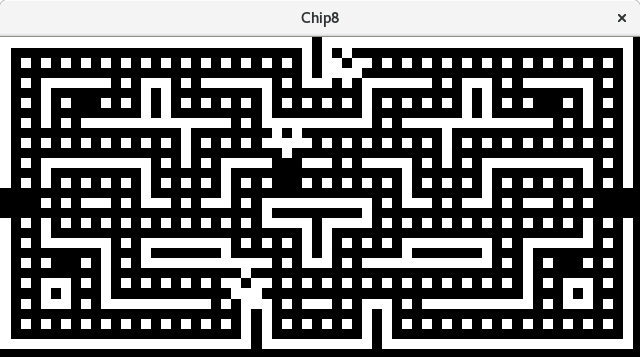
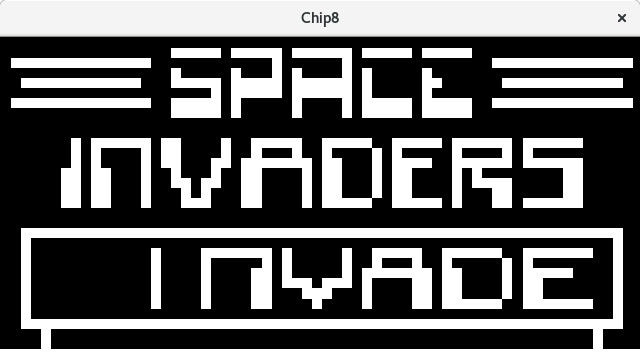

# CHIP-8 Emulator

     
     

This is a CHIP-8 Emulator, written in rust.

More information about Chip8 here:

- https://en.wikipedia.org/wiki/CHIP-8
- http://devernay.free.fr/hacks/chip8/C8TECH10.HTM

## Folders structure

    .
    ├── Cargo.lock
    ├── Cargo.toml
    ├── README.md
    ├── roms                - CHIP-8 ROMs
    │   ├── 15PUZZLE        - 15PUZZLE CHIP-8 ROM
    │   ├── ...             - ...
    │   └── WIPEOFF         - WIPEOFF CHIP-8 ROM
    └── src
       ├── bus.rs           - CHIP-8 Communication Bus code
       ├── chip8.rs         - CHIP-8 code
       ├── cpu.rs           - CHIP-8 CPU code
       ├── display.rs       - CHIP-8 Display code
       ├── keyboard.rs      - CHIP-8 Keyboard code
       ├── main.rs          - Main file
       └── memory.rs        - CHIP-8 Memory code

## Instruction

- Type `cargo build` to build the sources
- Type `cargo run` to run the emulator
